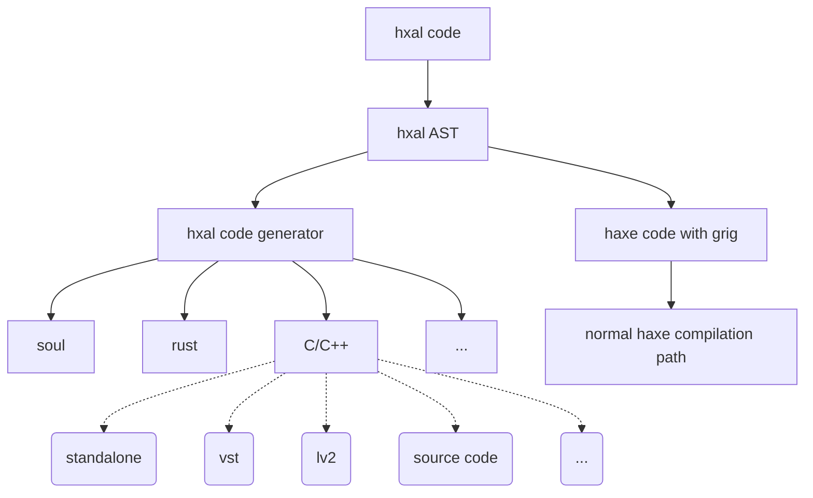

# hxal

[Haxe](https://haxe.org/) Audio Language. A haxe-based DSL for real-time audio applications built using haxe's macro system. Part of [grig](https://haxe.org/).

EARLY STAGE OF DEVELOPMENT. Ignore if you are expecting something you can use right away. Other parts of grig can be used now (grig.midi, grig.audio) but not this.

## Design Goals

* Look and behave like haxe
* Lightweight and simple
* Facilitates two different compilation pathways:
  * Straightforward compilation as haxe code with minimal modification by the macro aside from swapping hxal types for grig types
  * Transpilation straight to non-garbage-colleged targets. Planned:
    * [soul](https://soul.dev/)
    * rust
    * c/c++
* Allows declaration of variables, assignments, arithmetic but prevents allocations and frees, ensuring that the code is suitable for realtime even on gc targets.
* Meant to be easy to port legacy c++ code to, rather than being a radically different paradigm like faust
* Err on the side of simple and works, rather than being clever
* Designed to build atop other's work, in keeping with the general philosophy of haxe.
* All errors should be caught by VSCode and others' error checking. This is just haxe code, after all!
* Per frame and per midi event interface, which easily transforms to soul and, with hxal adding loops, to all the other environments

## Dual Code Paths



## Overview

To create a node that does processing - it can be an instrument or an effect - by creating a class that extends `grig.hxal.Node`. This will automatically bring in the macros that check the code and, as needed, use it to generate code.

```haxe
import grig.hxal.Node;

class SineSynth extends Node
{
}
```

hxal extensively uses compiler metadata for supplying information to different plugin formats. You may add any number of names, along with the ISO 639-1 language code for the translation and a version to the class:

```haxe
@name("Sine Synth", 'en')
@name("サインシンセサイザー", 'jp')
@version("0.0.1")
class SineSynth extends Node
```

In a `Node` class, you can have variables and functions, with some limitations. Currently, access modifiers aren't supported for simplicity (it has no meaning in plugins or non-oo targets). But final keyword is (and encouraged!) All variables, whether class members or defined in functions must be one of the following types:

* `Int`
* `UInt`
* `Int8`
* `UInt8`
* `Int16`
* `UInt16`
* `Int32`
* `UInt32`
* `Int64`
* `UInt64`
* `Float`
* `Float32`
* `Float64`
* `Sample`
* `Array<Type, Length>` in variable declarations or `Array<Type>` in arguments
* `Bool`

`Int` and `UInt` alias to whatever is the fastest int type on the architecture, same with `Float`. `Sample` is whichever format is used for audio samples, *which doesn't necessarily map to another type on the list*.

Class member variables can be marked as parameters using metadata:

```haxe
@parameter
@name("OSC1 Frequency", 'en')
var frequency1:Float;
```

As with the class itself, multiple name, language code pairs are supported for translations.

```haxe
@parameter @name("OSC1 Frequency", 'en') var frequency1:Float;
```